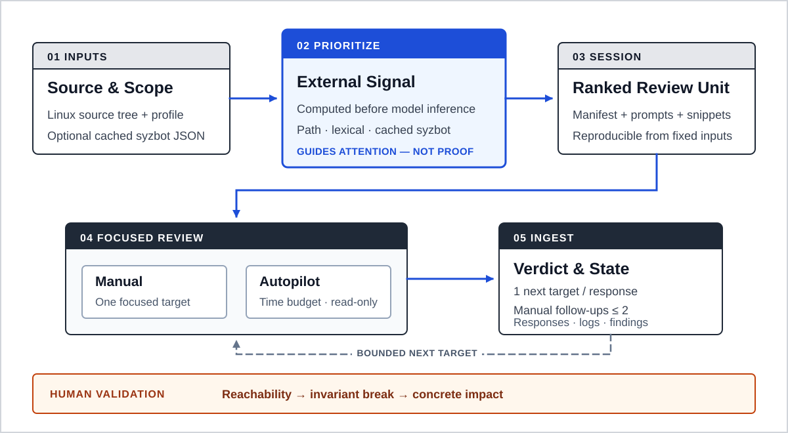

# Kernel Codex Harness

[](https://github.com/foxirain/linux-kernel-codex-harness/actions/workflows/ci.yml)

<p align="center"><strong>Research Tool · Original Import: 3 April 2026 · Documentation Revision: 11 July 2026</strong></p>

<p align="center"><strong>Core Philosophy — External Signal</strong><br>Let reproducible observations outside model inference guide attention; never mistake priority for proof.</p>

> **Project status.** 이 저장소는 실제 Linux 커널 취약점 조사를 위해 구축하고 사용한 LLM-assisted research harness의 초기 버전입니다. 이 버전은 [CVE-2026-31720](https://nvd.nist.gov/vuln/detail/CVE-2026-31720)으로 공개된 취약점을 발견하는 데 사용됐습니다. 하네스는 조사 대상을 우선순위화하지만 취약점을 자동으로 증명하거나 커널의 보안성을 보장하지 않으며, 최종 검증과 보고는 사람이 수행합니다.

## Abstract

**Abstract—** Linux 커널처럼 규모가 큰 코드베이스를 LLM에 그대로 탐색시키면 컨텍스트가 빠르게 분산되고, 위험한 API의 존재와 실제 공격 가능성이 쉽게 혼동된다. `Kernel Codex Harness`는 이 문제를 취약점 자동 탐지보다 **조사 우선순위 결정과 상태 기반 오케스트레이션**의 문제로 정의한다. 이 프로젝트는 LLM 추론 외부에서 계산한 재현 가능한 관찰값으로 모델의 attention을 통제하는 원칙을 **External Signal**이라 부른다. 커널 경로, userspace 경계, lifetime·usercopy·refcount·size 관련 정적 신호와 선택적 syzbot crash intelligence를 결합해 후보 파일을 순위화하고, 각 후보를 좁은 프롬프트 번들로 변환한다. 수동 검토와 시간 예산 기반 autopilot은 동일한 응답 계약과 세션 상태를 사용한다. 이 하네스는 실제 Linux 커널 조사에서 USB gadget audio 경로의 stack out-of-bounds write를 발견하는 데 사용됐고, 해당 결함은 [CVE-2026-31720](https://nvd.nist.gov/vuln/detail/CVE-2026-31720)으로 공개됐다. 본 구현은 정밀 정적 분석기가 아니라 설명 가능한 휴리스틱으로 LLM 조사 범위를 제한하는 research workflow이며, 모든 finding은 reachability, invariant break, concrete impact에 대한 사람의 재검증을 요구한다.

**Index Terms—** Linux kernel, vulnerability research, external signal, LLM orchestration, heuristic prioritization, syzbot, program analysis, Codex.

## I. Introduction

Linux 커널 보안 검토에는 두 종류의 규모 문제가 있다. 첫째, 전체 소스 트리는 한 번의 LLM 컨텍스트로 다루기에 너무 크다. 둘째, `copy_from_user`, allocator, refcount, lock과 같은 신호는 흔하지만 그 자체로 취약점을 의미하지 않는다. 분석자는 먼저 “어디를 볼 것인가”를 결정한 뒤, userspace reachability와 구체적인 상태 전이를 별도로 증명해야 한다.

이 프로젝트의 핵심 철학은 **External Signal**이다.

> LLM이 스스로 어디를 볼지 결정하게 두지 않는다. 모델 추론 바깥의 재현 가능한 신호가 attention을 배분하되, 취약점 결론은 reachability와 invariant evidence로만 결정한다.

따라서 하네스는 모델에게 커널 전체를 막연하게 탐색시키지 않는다. 파일을 우선순위화하고, 한 번에 하나의 조사 분기만 제공하며, 결론보다 증거 구조를 먼저 요구한다.

## II. External Signal and Design Principles

### A. External Signal Before Model Inference

**External Signal**은 LLM이 생성한 판단이 아니라, 모델 실행 전에 결정되며 동일한 소스 트리·profile·저장된 syzbot JSON에서 다시 계산할 수 있는 관찰값이다. 경로 weight, 정규식 hit, cached syzbot overlap이 이에 해당한다. 이 신호는 후보 순위와 프롬프트 컨텍스트에만 사용하며, verdict나 proof로 승격하지 않는다.

이 문서의 **External Signal**은 프로젝트 철학 전체를 가리킨다. 코드의 `ExternalSignal` 데이터 모델은 현재 그중 syzbot에서 유래한 신호만 표현하므로 두 용어의 범위는 다르다.

### B. Prioritization Is Not Proof

정규식 hit, 고위험 경로, syzbot overlap은 모두 조사 순서를 위한 신호다. 점수가 높아도 실제 호출 경로, 권한, 커널 config, namespace, device availability가 공격자의 도달을 허용하지 않으면 보안 finding이 아니다.

### C. Reachability Before Bug Class

감사는 `syscall`, `ioctl`, `netlink`, `procfs`, filesystem, BPF, driver hook처럼 userspace에서 시작되는 경계를 먼저 확인한다. 이후에야 UAF, OOB, refcount, race, info leak, capability check 같은 bug class를 평가한다.

### D. One Investigation Branch at a Time

한 조사 단위는 기본적으로 하나의 파일과 가까운 caller·teardown·free path로 제한된다. 모델이 추천하는 manual follow-up은 최대 두 번만 허용한다. 이 제한은 탐색 능력을 줄이기 위한 것이 아니라, 검증 가능한 범위 안에서 결론을 유지하기 위한 것이다.

### E. Evidence Over Confidence

프롬프트는 강한 finding이 최소한 다음 항목을 설명하도록 요구한다.

1. attacker-reachable entrypoint,
2. attacker-controlled field 또는 lifetime transition,
3. 깨지는 object·length·state invariant,
4. corruption, leak, privilege escalation 등 구체적인 impact,
5. 기존 check가 공격을 막지 못하는 이유.

근거가 부족하면 모델은 취약점을 강하게 주장하는 대신 다음에 확인할 단일 타깃을 반환한다. 이는 **prompt-level evidence contract**이며, 현재 parser가 각 증거의 완결성을 자동 검증하는 것은 아니다. ingestion은 verdict와 next target을 정규화하므로 최종 증거 검증은 사람의 책임이다.

### F. Design Lineage

초기 조사 흐름은 Protect AI의 `vulnhuntr`가 사용한 파일 단위 분석, 제한된 컨텍스트 확장, 구조화된 결과물이라는 발상에서 출발했다 [1]. 이 프로젝트에서는 이를 Python 애플리케이션 분석에 그대로 적용하지 않고, userspace-reachable kernel surface, 커널 객체 lifetime, teardown path, syzbot overlap을 중심으로 다시 설계했다. 특히 **우선순위 신호와 취약점 증명을 분리하고, reachability를 bug class보다 먼저 확인하는 것**이 커널 하네스의 핵심 설계 선택이다.

## III. System Architecture

<p align="center">
  
</p>

<p align="center"><strong>Fig. 1.</strong> The External Signal layer turns observations computed before model inference into ranked review units. It allocates attention but does not establish vulnerability proof.</p>

**TABLE I — MAJOR MODULE RESPONSIBILITIES**

| Module | Responsibility |
| --- | --- |
| `targeting.py` | 커널 파일 탐색과 경로·패턴·syzbot 신호 점수화 |
| `models.py` | `Candidate`, `Signal`과 syzbot-derived `ExternalSignal` 데이터 모델 |
| `bundle.py` | manifest, session index, prompt/snippet bundle 생성 |
| `prompting.py` | reachability와 invariant 중심의 커널 감사 프롬프트 |
| `session.py` | pending review, history, follow-up depth 상태 저장 |
| `ingest.py` | strict verdict와 next target 정규화 |
| `autopilot.py` | 시간 예산 기반 `codex exec`, 로그, archive, finding 관리 |
| `syzbot.py` | 공개 syzbot 페이지 수집과 로컬 JSON 캐시 생성 |
| `cli.py` | `scan`, `inspect`, `codex`, `loop`, `autopilot` 등 명령 연결 |

## IV. Methodology

### A. Candidate Discovery and Scoring

스캐너는 profile의 include directory 아래 `.c`와 `.h` 파일을 순회한다. 파일 `f`의 우선순위 점수는 개념적으로 다음과 같이 구성된다.

```text
Score(f) = Σ path_weight(f)
         + Σ line_signal_weight(f)
         + Σ syzbot_overlap_weight(f)
```

이 점수는 확률이나 exploitability 척도가 아니다. 각 항목은 모델이 먼저 확인할 파일을 정하기 위한 상대적 순서만 제공한다. 현재 구현은 모든 line-level match를 합산하고, prompt에 표시할 상위 신호만 제한한다. 동일한 결과의 재계산은 같은 source tree, profile과 cached syzbot JSON을 전제로 한다. syzbot weight는 path·line 휴리스틱으로 먼저 후보가 된 파일에 사후 적용되며, syzbot hit만으로 새로운 후보 파일을 생성하지는 않는다.

주요 정적 신호는 다음과 같다.

- `ioctl`, compat handler, file operation hook
- `copy_from_user`, `copy_to_user`, `__user`
- `kmalloc`, `kzalloc`, `kvmalloc`, cache allocation과 free path
- refcount, atomic, kref 연산
- size·length 계산과 memcpy 계열
- lock, RCU, async lifetime 관련 패턴
- BPF, skb, XDP, netlink 경계
- capability와 namespace check

### B. Profile-Driven Scope

내장 프로필은 `default`, `net`, `fs`, `io_uring`, `bpf`, `drivers`다. 프로필은 include path, pattern, weight, 한 파일에서 보존할 신호 수를 정의한다. 전체 커널에 하나의 scoring policy를 적용하는 대신 subsystem별 공격면과 lifetime 특성을 반영한다.

### C. Crash Intelligence

`syzbot-fetch`는 syzkaller 프로젝트의 공개 syzbot bug page [2]에서 title, subsystem, bug type, file:line 정보를 추출해 JSON cache로 저장한다. exact file overlap은 강한 External Signal로, subsystem overlap은 약한 External Signal로 사용한다. live dashboard는 변할 수 있으므로 재현 단위는 fetch 시점의 저장된 JSON이다. crash 정보는 variant hunting의 출발점일 뿐 새로운 취약점의 증거로 취급하지 않는다.

### D. Session and Review Contract

`scan`은 ranked candidate manifest와 상위 prompt bundle을 생성한다. 각 prompt는 target path, score reason, line signal, syzbot context와 감사 절차를 포함한다.

모델 응답은 다음 verdict 중 하나로 정규화된다.

- `cve_candidate`
- `plausible_security_bug`
- `latent_bug`
- `not_cve_candidate`
- `needs_more_context`

응답은 하나의 `Single best next target`과 짧은 summary를 포함한다. pending target이 없는 오래된 응답은 새 타깃에 연결하지 않고 별도 archive한다.

## V. Implementation and Usage

### A. Requirements

- Python 3.11 이상
- autopilot 사용 시 Codex CLI [3]와 인증
- 원격 syzbot dashboard 수집 시 네트워크 연결

### B. Installation

```bash
git clone https://github.com/foxirain/linux-kernel-codex-harness.git
cd linux-kernel-codex-harness

python3 -m venv .venv
source .venv/bin/activate
python -m pip install .
```

내장 profile JSON은 wheel에 포함된다. 외부 JSON 규칙은 `--config /path/to/profile.json`으로 전달할 수 있다.

### C. Minimal Workflow

```bash
# 1. Create a ranked session.
kernel-harness scan /path/to/linux \
  --profile net \
  --limit 80 \
  --top 20 \
  --out artifacts

# 2. Inspect high-priority candidates.
kernel-harness inspect artifacts/session-YYYYMMDDTHHMMSSZ --top 10

# 3. Render one focused prompt.
kernel-harness codex artifacts/session-YYYYMMDDTHHMMSSZ \
  --rank 1 \
  --include-snippet
```

`--limit`은 manifest에 유지할 candidate 수이고, `--top`은 처음에 미리 생성할 prompt bundle 수다. 이후 rank의 bundle도 요청 시 생성할 수 있다.

### D. Time-Budgeted Autopilot

```bash
kernel-harness autopilot artifacts/session-YYYYMMDDTHHMMSSZ \
  --duration 30m \
  --per-run-timeout 10m \
  --include-snippet
```

기본 sandbox는 `read-only`다. 분석 과정에서 파일 수정이 반드시 필요한 경우에만 `--sandbox workspace-write`를 명시해야 한다.

### E. Optional syzbot Feed

```bash
kernel-harness syzbot-fetch https://syzkaller.appspot.com/upstream \
  --out artifacts/syzbot/upstream.json \
  --limit 50

kernel-harness scan /path/to/linux \
  --profile fs \
  --syzbot-json artifacts/syzbot/upstream.json \
  --out artifacts
```

### F. Session Artifacts

```text
artifacts/session-<timestamp>/
├── SESSION.md
├── targets.json
├── finding_template.json
├── review_state.json
├── codex_response.txt              # present while a response is pending
├── bundles/
│   ├── <rank>-<target>.md
│   └── <rank>-<target>.snippet.txt
├── responses/
└── autopilot/
    ├── AUTOPILOT_STATUS.txt
    ├── AUTOPILOT_PROGRESS.txt
    ├── AUTOPILOT_FINDINGS.txt
    ├── prompts/
    ├── exec/
    └── findings/
```

## VI. Operational Outcome and Verification

이 버전은 개념 증명에 머물지 않고 실제 Linux 커널 취약점 조사에 사용됐다.

**TABLE II — DISCLOSED VULNERABILITY OUTCOME**

| Public outcome | Affected area | Vulnerability | Investigation model |
| --- | --- | --- | --- |
| [CVE-2026-31720](https://nvd.nist.gov/vuln/detail/CVE-2026-31720) | USB gadget audio · `drivers/usb/gadget/function/f_uac1_legacy.c` | Host-controlled request length could overflow a four-byte stack object | Finding surfaced during a v1-assisted investigation; validation and disclosure remained human-led |

검증은 탐지 정확도 benchmark가 아니라 구현의 회귀와 배포 가능성에 초점을 둔다.

**TABLE III — ENGINEERING VERIFICATION SCOPE**

| Verification item | Expected property |
| --- | --- |
| Allocator regression | `kmalloc`과 `kvmalloc`을 allocator signal로 탐지 |
| Profile resources | source checkout에서 6개 built-in profile 로딩, installed wheel에서 `default` profile smoke-test |
| Verdict contract | `not_cve_candidate`를 positive finding으로 오인하지 않음 |
| Follow-up policy | 두 번의 manual follow-up 허용, 세 번째 요청 차단 |
| Stale response handling | pending target 없는 응답을 archive하고 재사용하지 않음 |
| Safe default | autopilot sandbox 기본값이 `read-only` |
| CI matrix | Python 3.11과 3.12에서 regression suite 실행 |

```bash
python -m unittest discover -s tests -v
```

GitHub Actions는 unit regression을 실행한 뒤 wheel을 새 환경에 설치하고 `default` profile scan을 smoke-test한다. 위 공개 사례는 실제 조사에서 얻은 operational outcome이지만 대표 Linux tree corpus에서 측정한 precision, recall 또는 CVE discovery rate benchmark는 아니다.

## VII. Safety Considerations

- 기본 `read-only` sandbox를 유지하는 것을 권장한다.
- 외부 sandbox가 없는 환경에서는 `--dangerously-bypass-approvals-and-sandbox`를 사용하지 않는다.
- 신뢰할 수 없는 source comment와 identifier도 모델 입력이 될 수 있으므로 prompt injection을 고려해야 한다.
- 모델이 생성한 finding은 공개 또는 보고 전에 사람이 reachability와 impact를 다시 검증해야 한다.
- syzbot crash와 높은 heuristic score를 취약점 증명으로 인용해서는 안 된다.

## VIII. Limitations and Threats to Validity

1. **Lexical analysis.** 실제 C AST, call graph, interprocedural data flow를 구축하지 않는다.
2. **Score bias.** 주석, 매크로, 반복 token, 큰 파일이 점수에 과도한 영향을 줄 수 있다.
3. **Reachability gap.** 커널 config, privilege, namespace, device availability를 자동 모델링하지 않는다.
4. **External data fragility.** syzbot integration은 공개 HTML 구조 변경의 영향을 받는다.
5. **Model dependence.** 결과 품질은 사용한 모델, prompt interpretation, repository context에 의존한다.
6. **Evaluation scope.** 현재 테스트는 software regression을 검증한다. 공개된 CVE 사례는 실제 사용 결과이지만 보안 탐지 성능에 대한 통계적 평가를 대체하지 않는다.

## IX. Retrospective

Git history에 기록된 최초 버전부터 목표는 “LLM이 취약점을 알아서 찾게 하는 것”보다 “어떤 코드를 먼저 보고 어떤 증거를 요구할지 통제하는 것”에 가까웠다. CVE-2026-31720을 발견한 v1-assisted 조사는 좁은 investigation unit과 evidence contract가 실제 연구에 적용된 사례를 제공했다. [v2](https://github.com/foxirain/linux-kernel-codex-harness-v2)는 이 workflow를 repository state와 known reference를 함께 보존하는 provenance-aware triage까지 확장했다. 지금 다시 구현한다면 다음을 우선한다.

1. tree-sitter 또는 Clang 기반 symbol/call graph,
2. 파일 크기와 반복 hit를 고려한 score normalization,
3. `review`와 `runner` 계층 분리를 통한 CLI/autopilot 중복 제거,
4. versioned manifest와 atomic state write,
5. JSON Schema 기반 model response와 structured evidence,
6. syzbot crash, fix commit, nearby variant의 자동 연결.

그럼에도 유지하고 싶은 중심 원칙은 **External Signal**이다. **LLM에게 코드베이스 전체를 막연하게 탐색시키지 않고, 모델 바깥의 신호로 좁힌 조사 단위를 reachability와 invariant 중심으로 반복한다.**

## X. Conclusion

`Kernel Codex Harness`는 Linux 커널 취약점 탐지를 대체하지 않는다. 대신 External Signal을 설명 가능한 순위로 바꾸고, LLM 검토를 짧고 상태가 있는 조사 과정으로 제한한다. 이 구조는 실제 조사에서 CVE-2026-31720 발견에 사용됐다. 프로젝트의 핵심 결과는 새로운 분석 알고리즘을 주장하는 데 있지 않고, LLM 보안 검토를 **external-signal attention allocation, evidence contract, reproducible orchestration**의 문제로 정의하고 실전 연구 workflow에 적용한 데 있다.

## Appendix A. Repository Layout

```text
.
├── .github/workflows/ci.yml
├── docs/
│   ├── assets/kernel-harness-architecture.svg
│   ├── AUTOPILOT.md
│   ├── CODEX_CLI.md
│   ├── CODEX_WORKFLOW.md
│   └── SYZBOT.md
├── kernel_harness/
│   ├── resources/
│   │   ├── linux-kernel-default.json
│   │   └── profiles/
│   ├── autopilot.py
│   ├── bundle.py
│   ├── cli.py
│   ├── ingest.py
│   ├── models.py
│   ├── prompting.py
│   ├── session.py
│   ├── syzbot.py
│   └── targeting.py
├── tests/test_regressions.py
├── README.md
└── pyproject.toml
```

세부 운영 절차는 [`docs/`](docs/)에서 확인할 수 있다.

## References

[1] Protect AI, “vulnhuntr,” GitHub repository. <https://github.com/protectai/vulnhuntr>

[2] Google, “syzkaller and syzbot,” GitHub repository. <https://github.com/google/syzkaller>

[3] OpenAI, “Codex CLI.” <https://developers.openai.com/codex/cli/>

## License

Licensed under the [Apache License 2.0](LICENSE).
